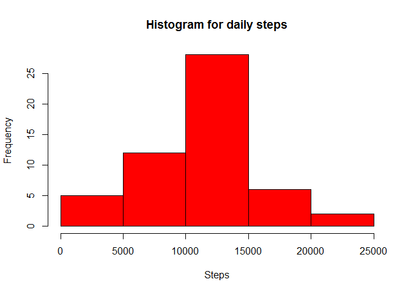

# Reproducible Research: Peer Assessment 1


## Loading and preprocessing the data


```r
activity<-read.csv("activity\\activity.csv", header=TRUE, sep=",")
```


## What is mean total number of steps taken per day?

```r
options(scipen = 1, digits = 2)
library(plyr)
dailyActivity<-ddply(activity, .(date), summarize, DailySteps=sum(steps))
hist(dailyActivity$DailySteps, main="Histogram for daily steps", xlab="Steps", col="red")
```

 

```r
meanSteps<-mean(dailyActivity$DailySteps, na.rm=TRUE)

medianSteps<-median(dailyActivity$DailySteps, na.rm=TRUE)
```

The mean steps per day is 10766.19 and the median steps is 10765 

## What is the average daily activity pattern?

```r
intervalActivity<-ddply(activity, .(interval), summarize, meanSteps=mean(steps, na.rm=TRUE))
with(intervalActivity, plot(interval, meanSteps,type="l", ylab="Average Steps", main="Average daily activity", col="blue"))
```

 

```r
mostSteps<-intervalActivity[intervalActivity$meanSteps == max(intervalActivity$meanSteps),]
```

Most steps interval is 835 with 206.17 steps


## Inputing missing values

```r
MissingValues<-sum(is.na(activity$steps))
```
Missing values within data set 2304

Apply mean of 5 minute interval to fill in missing data

```r
  activityFilled<-merge(activity, intervalActivity, by.x="interval", by.y="interval")
  activityFilled$steps[is.na(activityFilled$steps)]<-activityFilled$meanSteps[is.na(activityFilled$steps)]
  dailyActivityFilled<-ddply(activityFilled, .(date), summarize, DailySteps=sum(steps))
  hist(dailyActivityFilled$DailySteps, main="Histogram for daily steps", xlab="Steps", col="red")
```

 

```r
  meanStepsFilled<-mean(dailyActivityFilled$DailySteps, na.rm=TRUE)
  medianStepsFilled<-median(dailyActivityFilled$DailySteps, na.rm=TRUE)
```

After populating NA's the mean steps per day is 10766.19 and the median steps is 10766.19.  The Mean remains the same and the median increases by 1.19

## Are there differences in activity patterns between weekdays and weekends?

```r
activityFilled$weekday<- weekdays(as.Date(activityFilled$date))
activityFilled$IsWeekend<-ifelse(activityFilled$weekday=="Saturday"|activityFilled$weekday=="Sunday","Weekend", "Weekday")
activityFilled$weekday<-NULL

activityWeekend<-ddply(activityFilled, ~interval+IsWeekend, summarise, mean=mean(steps))

library(lattice)
xyplot(mean~interval| factor(IsWeekend), data=activityWeekend,type = "l", ylab="Steps")
```

 
